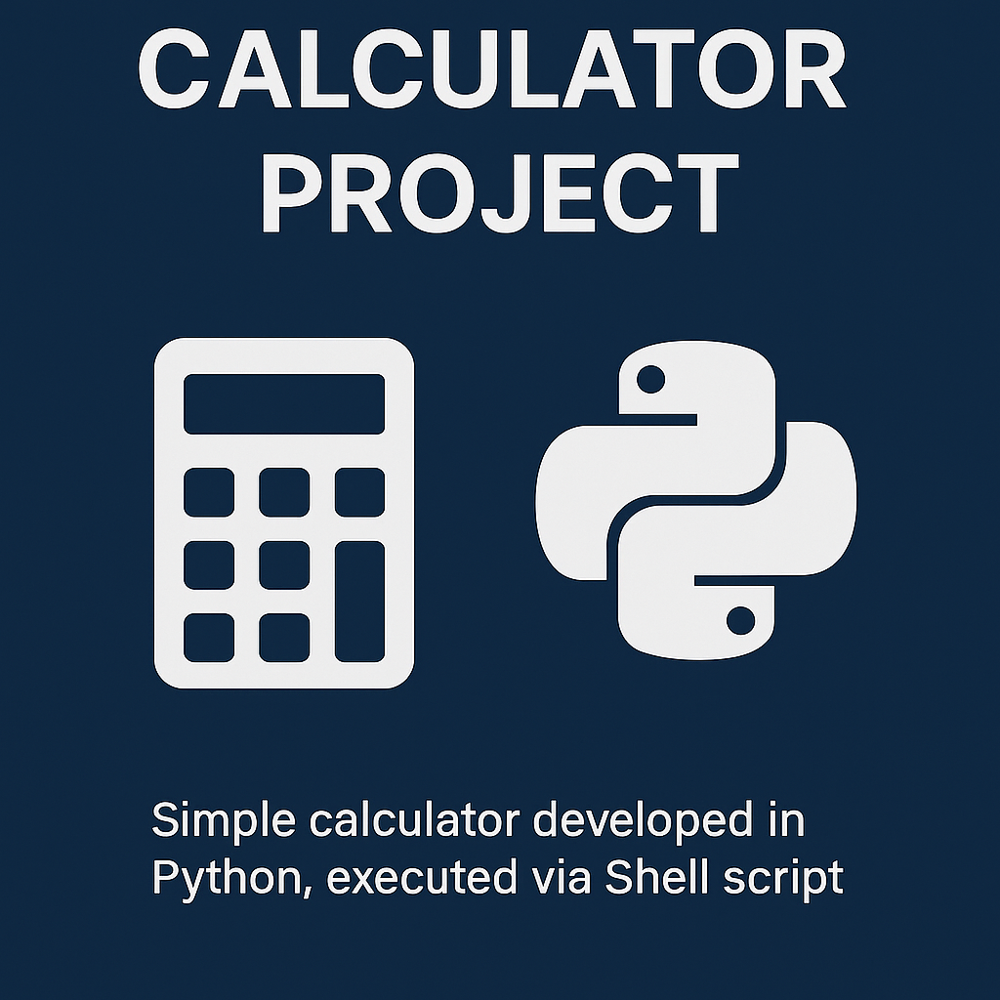

  

# EBAC Calculator Project

This repository contains a simple calculator developed in **Python**, which can be executed via a **Shell Script on Linux**. It was created as part of the EBAC programming activities.

---

## Project Structure

EBAC-Calculator-Project/
├── Calculator.py # Main Python script
└── Calculator.sh # Shell script to execute the calculator

## How to Run

1. **Navigate to the project directory in the terminal:**
   
   cd EBAC-Calculator-Projet

2. **Make the shell script executable:**

   chmod +x Calculator.sh

3. **Run the shell script to launch the calculator:**

   ./Calculator.sh

## Code Description

The Calculator.py script allows the user to perform basic mathematical operations, including:

➕ Addition

➖ Subtraction

✖️ Multiplication

➗ Division

## How It Works:

User Input: Prompts the user to enter two numbers and select an operation.

Conditional Logic: Based on the chosen operation, the script performs the correct calculation using conditional structures.

Output: The result of the selected operation is displayed to the user.

## Requirements

1. Python 3 installed

2. Linux terminal with permission to execute shell scripts

## License

This project is licensed under the MIT License. See the `LICENSE` file for details.

---

## Author

Bruno Brehmer Massaneiro

